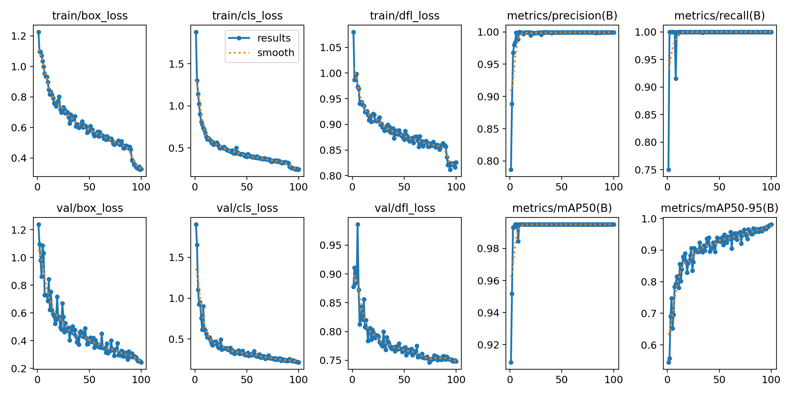
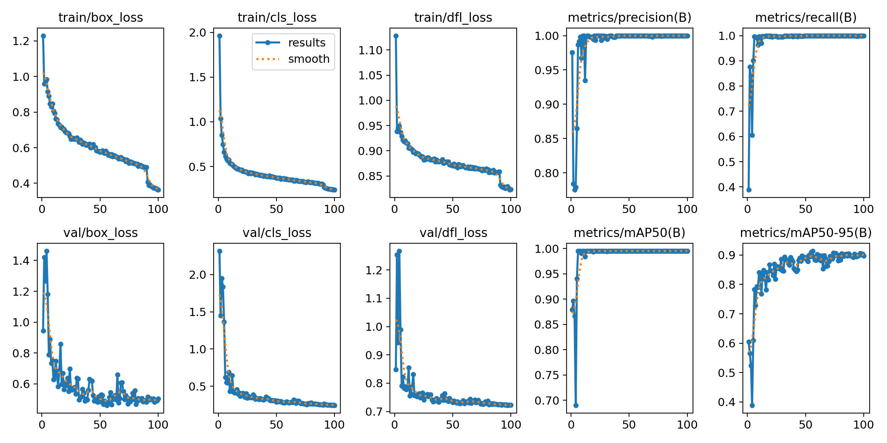
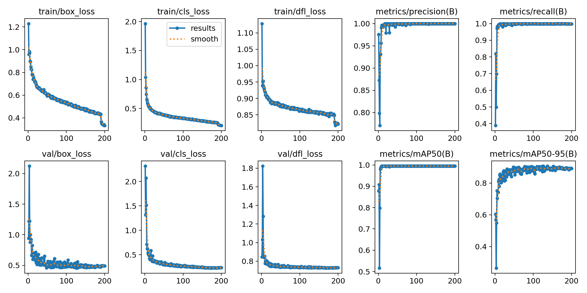
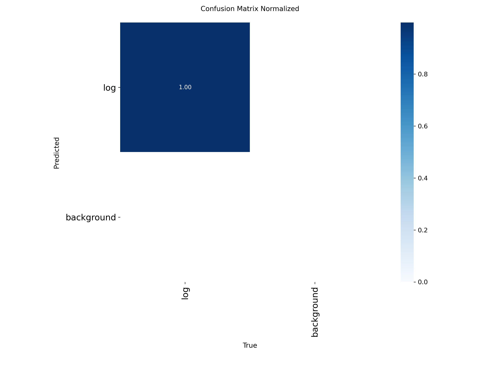

# timber-measurement-edge

> Production edge system for real-time log dimension measurement.


https://github.com/user-attachments/assets/c7d660b8-5de0-4be0-b073-2e68bc819322

---

## The Problem

The facility's traditional workflow required dedicated workers per shift to manually count and measure log dimensions as logs moved through the production line. This process had two core issues:

- **Labor cost** — shift workers assigned solely to counting and measuring
- **Human error** — measurements were manually rounded before recording (e.g., an actual reading of 14.1 cm would be written down as 15 cm), degrading data accuracy and traceability

---

## The Solution

An automated edge system running on Raspberry Pi 5 that measures log dimensions in real time using computer vision and laser displacement sensors, then publishes all measurements to a cloud IoT platform for live monitoring and historical analysis.

Workers no longer need to be assigned to manual measurement. All data is captured automatically, precisely, and continuously.

---

## System Architecture

```
┌──────────────────────────────────────────────────────────────────────────┐
│  Raspberry Pi 5 + Hailo-8                                                │
│                                                                          │
│  ┌──────────────┐    ┌───────────┐    ┌─────────┐    ┌───────────┐       │
│  │ Camera(RTSP) │───▶ Detection │─┐  │         │    │           │       │
│  └──────────────┘    └───────────┘ ├─▶ Combine │───▶ Publisher │──────▶ Cloud
│  ┌──────────────┐    ┌───────────┐ │            │    │           │       │
│  │Modbus Sensors│───▶ Diameter  │─┘  └─────────┘    └───────────┘       │
│  └──────────────┘    └───────────┘                                       │
│                                                                          │
│  ┌──────────────┐    ┌───────────┐                                       │
│  │ Camera(RTSP) │───▶   Record  │───▶ SSD                              │
│  └──────────────┘    └───────────┘                                       │
│                                                                          │
│  ┌──────────────┐                                                        │
│  │  Monitoring  │───────────────────────────────────────────────▶ Cloud │
│  └──────────────┘                                                        │
└──────────────────────────────────────────────────────────────────────────┘
```

---

## Hardware

| Component        | Details                                    |
|------------------|--------------------------------------------|
| Edge Device      | Raspberry Pi 5                             |
| AI Accelerator   | Hailo-8 via PCIe HAT                       |
| Camera           | IP Camera via RTSP                         |
| Diameter Sensors | 4x Laser displacement sensors, Modbus RTU  |
| Storage          | External SSD                               |
| UPS              | Connected via USB (NUT)                    |
| Remote Access    | Tailscale VPN                              |

---

## Tech Stack

| Layer       | Technology                                      |
|-------------|-------------------------------------------------|
| AI Pipeline | Hailo TAPPAS, GStreamer, hailo-apps-infra        |
| Sensors     | pymodbus (Modbus RTU)                           |
| Telemetry   | paho-mqtt, MQTT broker                          |
| System      | systemd services, Python 3.11, Raspberry Pi OS  |

---

## Services

| Service          | Description                               |
|------------------|-------------------------------------------|
| `detection`      | AI-based length measurement via Hailo-8   |
| `sensor-diameter`| 4-axis diameter reading via Modbus RTU    |
| `combine`        | Matches length + diameter by timestamp    |
| `publisher`      | Publishes measurements to cloud via MQTT  |
| `record`         | Continuous RTSP video recording to SSD    |
| `monitoring`     | RPi health and system status to cloud     |

---

## Data Flow

```
1. detection       → detects log in frame, calculates pixel width → length measurement
2. sensor-diameter → reads 4 laser sensors via Modbus → diameter measurement
3. combine         → matches length + diameter records by timestamp window
4. publisher       → publishes each record to cloud via MQTT (QoS 2)
```

---

## Key Design Decisions

### Length Measurement
Custom callback built on top of hailo-apps-infra's GStreamer detection pipeline. Tracks each log by unique ID across frames, calculates length from bounding box pixel width using a calibrated pixels-per-mm ratio, and records the best measurement when the log exits frame or stabilizes.

The system records the **best** measurement across all frames rather than the first or last — logs can be partially occluded when entering or exiting the frame, so waiting for the largest stable reading gives a more accurate result.

### Diameter Measurement
Reads 4 laser displacement sensors (Left, Right, Top, Bottom) over Modbus RTU at 0.5s intervals. Detects log entry/exit by monitoring sensor window states. Calculates horizontal and vertical diameter from opposing sensor pairs and saves averaged statistics per log pass.

A stall detection mechanism discards measurements if the log stops mid-frame — a stationary log would produce a biased average that does not represent the true cross-section. Only complete, moving passes are recorded.

### Record Matching
The two sensors (camera and Modbus) are independent processes with no shared clock signal, so exact timestamp alignment is not guaranteed. A configurable matching window (±30s) accounts for natural timing differences between when a log passes the camera versus the sensor array. Unmatched records are still written to the output rather than discarded — preserving partial data is more useful than losing a measurement entirely.

### MQTT Publishing
Uses a persistent byte offset so that if the service restarts — due to a crash or system reboot — it resumes exactly where it left off without re-sending already-published records or skipping new ones. All messages use QoS 2 for exactly-once delivery.

### Video Recording
Continuously records the RTSP camera stream to the SSD in 1-hour segments as a redundancy layer. If the detection pipeline crashes or produces unexpected results, the raw footage can be used to re-run detection offline and recover the data. Segments older than 32 days are automatically deleted.

---

## Monitoring

System and health metrics published to cloud every 15 minutes (system status) and every 1 minute (hardware health).

| Metric Group  | Parameters                                                                 |
|---------------|----------------------------------------------------------------------------|
| Hardware      | `cpu_usage`, `cpu_temp`, `cpu_freq_mhz`, `ram_usage`, `sd_card_usage`, `ssd_usage`, `uptime` |
| Connectivity  | `tailscale_online`, `camera_reachable`, `ssd_mounted`, `ups_online`       |
| Services      | Status of all 6 systemd services                                           |
| Data Freshness| Age in hours of each CSV and last MQTT publish timestamp                  |

---

## Model Training

The detection model was trained on a custom dataset of log images captured at the production site. Only one class (`log`) was required. The model went through multiple iterations to optimize performance for edge deployment.

### Version History

| Version | Images | Epochs | Batch | Device | mAP@0.5 | mAP@0.5:0.95 | Precision | Recall |
|---------|--------|--------|-------|--------|---------|---------------|-----------|--------|
| V2.0    | ~700   | 100    | 8     | CPU    | 0.995   | 0.981         | 1.00      | 1.00   |
| V3.1    | ~3000  | 100    | 64    | GPU    | 0.995   | 0.898         | 1.00      | 1.00   |
| V3.2    | ~3500  | 200    | 64    | GPU    | 0.995   | 0.900         | 1.00      | 1.00   |
| V3.4    | ~5000  | 200    | 64    | GPU    | 0.995   | 0.904         | 1.00      | 1.00   |

> V2.0 shows higher mAP@0.5:0.95 due to its smaller dataset — the model memorized most cases. V3.x was trained on progressively larger datasets with more diverse examples for better generalization in production. V3.4 is the currently deployed version.

### Training Curves

**V2.0** — 100 epochs, CPU, batch size 8


**V3.1** — 100 epochs, GPU, batch size 64


**V3.2** — 200 epochs, GPU, batch size 64


**V3.4 (deployed)** — 200 epochs, GPU, batch size 64


### Confusion Matrix (V3.4)


### Validation Predictions (V3.4)


---

*Deployed and maintained at a timber production facility. Source code is proprietary and not included in this repository.*
